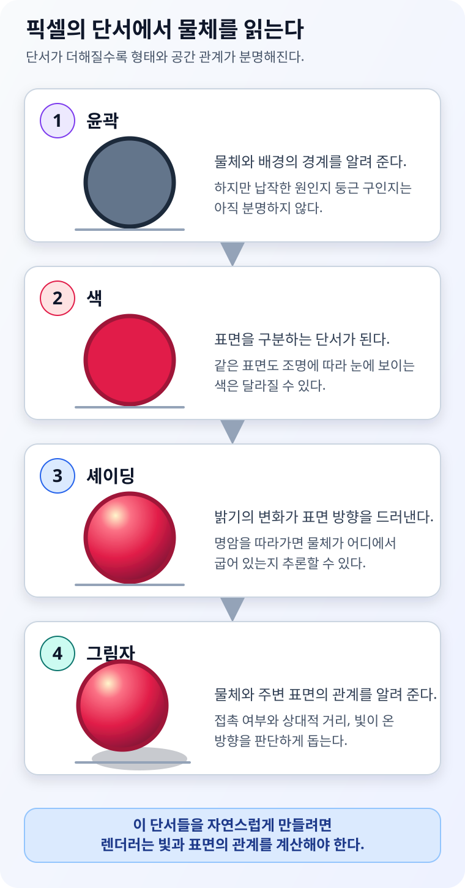
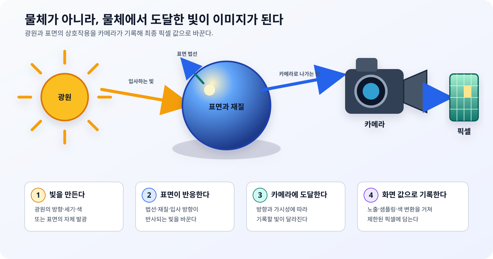

> 핵심 요약
> - 사람은 화면의 윤곽, 색, 셰이딩과 그림자를 단서로 물체의 재질, 형태와 공간 관계를 추론한다.
> - 셰이딩은 표면 안의 밝기 변화로 굽은 형태를 드러내고, 그림자는 물체와 주변 표면의 접촉과 상대적 위치를 판단하게 돕는다.
> - 색, 셰이딩과 그림자는 모두 빛이 표면에 닿고 이동한 결과이므로, 3D 그래픽스를 이해하려면 빛에서 출발해야 한다.

회색 원 하나를 화면에 그려 보자. 우리는 그것이 어디까지 차지하는지는 알 수 있지만, 납작한 원판인지 둥근 공인지는 쉽게 판단하지 못한다. 한쪽은 밝고 반대쪽은 어둡게 만들면 원은 구처럼 보이기 시작한다. 바닥에 그림자까지 더하면 공이 바닥에 놓였는지, 공중에 떠 있는지도 짐작할 수 있다.

화면에 물체의 깊이나 무게가 실제로 들어간 것은 아니다. 달라진 것은 픽셀의 색과 밝기뿐이다. 그런데 사람은 그 차이를 **물체의 형태와 위치에 관한 단서**로 해석한다.

3D 그래픽스가 해야 하는 첫 번째 일도 여기에 있다. 단순히 삼각형을 화면에 표시하는 것을 넘어, 사람이 하나의 물체와 공간으로 받아들일 수 있는 시각적 단서를 만들어야 한다.

*그림 1. 윤곽에서 시작해 색, 셰이딩과 그림자가 더해질수록 물체를 해석할 정보가 늘어난다. 직접 제작.*

## 사람은 픽셀을 보고 사물을 거꾸로 추론한다

눈에 들어오는 영상이나 모니터의 화면은 평면이다. 그 안에는 `이 부분은 구의 앞면`, `이 물체는 바닥에서 30cm 위` 같은 설명이 적혀 있지 않다. 사람의 시각은 경계, 색의 차이, 밝기의 변화와 다른 물체와의 관계를 조합해 그 원인을 거꾸로 추론한다.

| 화면에서 얻는 단서 | 사람이 주로 추론하는 것 |
| --- | --- |
| 윤곽과 가림 | 물체의 범위와 앞뒤 관계 |
| 색과 밝기 | 표면의 구분과 재질의 성질 |
| 셰이딩 | 표면의 방향, 굽음과 입체적인 형태 |
| 그림자 | 빛의 가려짐, 접촉과 상대적인 깊이 |
| 원근과 크기 변화 | 거리와 공간 배치 |

어느 한 단서만으로 물체를 완벽하게 알아내는 것은 아니다. 같은 회색도 주변 밝기에 따라 다르게 보일 수 있고, 같은 명암도 광원의 방향을 다르게 가정하면 오목하거나 볼록하게 해석할 수 있다. 그림자의 위치 역시 물체뿐 아니라 광원과 그림자가 맺히는 표면에 따라 달라진다.

따라서 시각은 여러 단서를 함께 사용한다. 그리고 그래픽스는 그 단서들이 서로 모순되지 않도록 장면을 그린다.

## 색은 물체에 붙어 있는 고정된 스티커가 아니다

우리는 사과를 보고 `빨간색 물체`라고 말한다. 그래서 3D 모델에도 빨간색 값을 넣으면 색에 대한 설명이 끝난 것처럼 느끼기 쉽다. 그러나 스스로 빛을 내지 않는 불투명한 물체에서 눈에 도달하는 색은 대체로 **조명이 가진 빛 가운데 표면이 반사한 부분**이다.

같은 사과도 햇빛 아래, 노란 전등 아래, 푸른 조명 아래에서 카메라가 기록하는 값은 달라진다. 그런데 사람은 주변 조명과 그림자까지 함께 해석해 가능한 한 일관된 표면색을 알아보려 한다. [Edward Adelson의 Checker Shadow 예시](https://persci.mit.edu/gallery/checkershadow/)는 물리적으로 같은 밝기의 두 영역도 그림자와 주변 문맥 때문에 서로 다르게 지각될 수 있음을 잘 보여 준다.

> **직접 확인해 보기**
>
> 먼저 [Checker Shadow 원본](https://persci.mit.edu/gallery/checkershadow/)에서 A와 B가 얼마나 다르게 보이는지 확인해 보자.
> 그다음 MIT가 제공하는 [원본과 밝기 증명 이미지](https://persci.mit.edu/gallery/checkershadow/download/)를 비교하면 두 칸의 실제 밝기가 같다는 사실을 확인할 수 있다.

그래픽스에서 보이는 색을 만들려면 최소한 세 관계를 생각해야 한다.

- 어떤 성분과 세기의 빛이 표면에 도달했는가
- 표면은 그 빛을 얼마나 흡수하고 어느 방향으로 반사하는가
- 카메라와 디스플레이는 도달한 빛을 어떤 픽셀 값으로 기록하고 보여 주는가

모델에 저장한 색은 이 관계 가운데 **표면이 빛에 반응하는 성질**을 표현하는 입력에 가깝다. 최종 화면의 색은 그 입력만으로 결정되지 않는다.

## 셰이딩은 명암으로 표면의 형태를 보여 준다

구의 윤곽만 보면 원과 구를 구분하기 어렵다. 하지만 광원을 향한 쪽은 밝고 반대쪽으로 갈수록 어두워지는 변화가 생기면, 우리는 표면이 어느 방향으로 굽어 있는지 읽기 시작한다. 이처럼 표면 위의 빛과 재질을 계산해 위치마다 다른 밝기와 색을 만드는 과정이 **셰이딩**이다.

명암에서 형태를 읽는 일은 미술의 오래된 표현법인 명암법에서도 사용되었다. 컴퓨터 비전과 컴퓨터 그래픽스가 태동하던 시기에는 이 관계가 서로 반대 방향의 문제로 연구되었다.

[Berthold Horn의 1970년 MIT AI 연구 보고서 *Shape from Shading*](https://people.csail.mit.edu/bkph/AIM/AITR-232-OCR-OPT.pdf)는 조명의 위치와 표면의 광학적 성질 같은 조건을 이용해 한 장의 명암 영상으로부터 매끄러운 물체의 형태를 구하는 방법을 다뤘다. `Shape from Shading`은 말 그대로 **명암에서 형태를 추론하는 문제**다. 명암에는 형태 정보가 들어 있지만, 조명과 재질에 대한 가정이 없으면 하나의 답으로 정하기 어렵다는 점도 함께 드러난다.

반대편에서 [Henri Gouraud는 1971년 *Continuous Shading of Curved Surfaces*](https://doi.org/10.1109/T-C.1971.223313)에서 제한된 다각형으로 표현한 곡면이 각져 보이는 문제를 줄이기 위해 정점의 밝기를 보간하는 연속 셰이딩 방법을 발표했다. 더 많은 기하를 무작정 늘리기 어려운 환경에서, 부드러운 명암 변화로 곡면의 형태를 전달하려는 선택이었다.

사람의 시각은 **밝기에서 형태를 추론**하고, 그래픽스는 **형태와 빛으로 밝기를 계산**한다. 셰이딩은 단순히 화면을 예쁘게 칠하는 장식이 아니라, 기하를 사람이 읽을 수 있는 형태로 바꾸는 정보다.

## 그림자는 물체를 공간에 놓아 준다

셰이딩된 구만으로도 둥근 형태는 느낄 수 있다. 그러나 바닥과 어떤 관계에 있는지는 여전히 모호할 수 있다. 구 아래에 붙은 그림자는 바닥과 접촉한 것처럼 보이게 하고, 그림자가 멀어지면 구가 떠 있거나 다른 깊이에 있는 것처럼 보이게 한다.

[Daniel Kersten, Pascal Mamassian과 David Knill의 1997년 실험](https://doi.org/10.1068/p260171)에서는 화면 속 물체의 위치와 크기를 그대로 둔 채 움직이는 그림자만 바꾸어도 물체가 깊이 방향으로 움직이는 듯한 강한 지각이 나타났다. 그림자가 물체의 3차원 이동을 직접 기록한 좌표는 아니지만, 사람의 시각이 공간 배치를 추론할 때 매우 강한 단서로 사용한다는 뜻이다.

> **움직임으로 확인해 보기**
>
> 정지 화면보다 [Kersten 연구실의 Cast Shadows, Motion, and Depth 데모](https://kerstenlab.psych.umn.edu/demos/shadows/)에서 효과가 훨씬 분명하게 보인다.
> 물체의 화면상 크기나 경로보다 그림자의 움직임이 달라질 때, 물체가 바닥을 따라가거나 공중으로 떠오르는 것처럼 해석되는 차이를 살펴보자.

그림자는 다음 관계를 한꺼번에 품고 있다.

- 어떤 물체가 빛을 막았는가
- 빛은 어느 방향에서 왔는가
- 그림자는 어느 표면에 맺혔는가
- 물체와 그 표면은 얼마나 떨어져 있는가

이 관계에는 여러 가능한 해석이 있으므로 그림자 하나만으로 정확한 위치를 계산할 수는 없다. 하지만 윤곽, 원근, 움직임과 함께 사용하면 물체의 접촉과 상대적 깊이를 훨씬 쉽게 판단하게 한다. 그림자가 빠진 3D 물체가 종종 바닥에서 떠 보이는 이유도 여기에 있다.

## 색과 형태와 위치를 따라가면 빛에 도착한다

지금까지의 출발점은 빛이 아니라 사물의 인식이었다. 그런데 사물을 알아보게 하는 단서를 하나씩 따라가면 같은 원인에 도착한다.

| 인식 단서 | 빛에 관해 필요한 질문 |
| --- | --- |
| 색 | 어떤 빛이 도달했고 표면이 무엇을 반사했는가 |
| 셰이딩 | 빛과 표면 방향에 따라 밝기가 어떻게 달라지는가 |
| 그림자 | 광원에서 표면까지 가는 길이 다른 물체에 막혔는가 |

현실에서 카메라는 물체의 삼각형이나 재질 파일을 읽지 않는다. 광원에서 나온 빛이 표면에 닿고, 표면이 그중 일부를 반사하거나 스스로 빛을 방출하면, 그 빛의 일부가 카메라 렌즈와 센서에 도달한다. 카메라는 도달한 빛을 기록해 이미지를 만든다.

컴퓨터 그래픽스는 이 과정을 수치로 재구성한다.

*그림 2. 색, 셰이딩과 그림자의 공통 원인인 광원, 표면, 카메라의 관계. 직접 제작.*

카메라에 도달하는 것은 물체 자체가 아니라 **물체에서 카메라 방향으로 온 빛**이다. 표면의 모양과 재질, 광원의 위치와 세기, 다른 물체에 의한 가려짐이 달라지면 기록되는 픽셀도 달라진다.

이제 이 글의 제목에 답할 수 있다.

> 3D 그래픽스가 빛에서 시작하는 이유는 모든 그래픽스가 사실적인 조명을 목표로 하기 때문이 아니다. 사람이 색, 형태와 공간을 인식하는 데 사용하는 중요한 단서들이 빛과 표면의 상호작용에서 생기기 때문이다.

조명 계산을 생략하고 지정한 색을 픽셀에 바로 기록하는 `Unlit` 방식도 있다. 하지만 이 방식은 빛이라는 원인을 재현하는 대신 디스플레이가 낼 결과 색을 직접 정한 것이다. 아이콘, 안내 표시나 의도적으로 평면적인 표현에는 유용하지만, 자연스러운 명암과 그림자까지 자동으로 설명하지는 않는다.

## 그래픽스는 인식의 반대 방향으로 문제를 푼다

사람의 시각이 픽셀에서 장면을 추론한다면, 렌더링은 장면의 원인으로부터 픽셀을 만든다.

- **시각의 방향**: 이미지 → 물체, 재질, 형태, 위치와 빛을 추론한다.
- **그래픽스의 방향**: 물체, 재질, 위치, 빛과 카메라 → 이미지를 계산한다.

한 프레임을 그리는 방식은 기술마다 다르지만, 인식 가능한 픽셀을 만들기 위해 답해야 하는 질문은 크게 다르지 않다.

*그림 3. 장면의 원인으로부터 한 픽셀을 만들기 위해 렌더러가 답하는 다섯 가지 질문. 직접 제작.*

1. **기하와 투영**은 표면이 화면의 어디에 놓이는지 정한다.
2. **카메라 가시성**은 겹친 표면 중 무엇이 보이는지 정한다.
3. **빛, 재질과 셰이딩**은 보이는 표면이 어떤 색과 밝기를 내는지 정한다.
4. **광원 가시성과 그림자**는 빛이 그 표면에 도달할 수 있는지 정한다.
5. **카메라, 샘플링과 출력**은 계산한 빛을 제한된 픽셀 값으로 기록한다.

이 질문들은 서로 분리되어 있지만 독립적이지 않다. 보이는 표면을 알아야 셰이딩할 지점을 정할 수 있고, 표면의 재질과 광원 방향을 알아야 밝기를 계산할 수 있다. 그림자를 판단하려면 다시 광원에서 바라본 가시성을 조사해야 한다.

## 셰이딩과 그림자는 같은 빛에서 나온 서로 다른 단서다

셰이딩은 보이는 표면의 한 지점이 빛과 재질에 어떻게 반응하는지를 계산한다. 표면이 빛을 정면으로 받는지, 거친지 매끄러운지, 카메라가 어느 방향에 있는지가 결과를 바꾼다.

그림자는 광원에서 그 표면까지 빛이 이동할 수 있는지를 묻는다. 표면의 반사 성질이 같아도 앞을 다른 물체가 가리면 직접광은 도달하지 못한다.

따라서 셰이딩만 계산했다고 그림자가 자동으로 생기지는 않는다. 반대로 그림자 영역을 찾았다고 그 표면의 최종 색을 알 수 있는 것도 아니다. 두 계산은 모두 빛을 다루지만, 하나는 **표면의 반응**, 다른 하나는 **빛 경로의 가시성**이라는 서로 다른 질문에 답한다.

## 빛을 이해하면 렌더링 기술의 계보가 연결된다

현실의 빛은 한 번만 이동하고 사라지지 않는다. 벽에 반사된 빛이 다른 물체를 밝히고, 유리를 통과하며, 안개와 먼지 속에서 산란한다. 이 모든 상호작용을 매 프레임 정확하게 계산하기는 어렵다.

[James T. Kajiya가 1986년에 발표한 *The Rendering Equation*](https://doi.org/10.1145/15886.15902)은 방출된 빛, 표면에 들어온 빛과 반사되어 나가는 빛의 관계를 하나의 일반적인 식으로 묶었다. 이 관계를 정확히 푸는 비용이 크기 때문에 렌더링 기술은 무엇을 직접 계산하고, 무엇을 근사하거나 저장할지 선택해 왔다.

Lambert와 Phong은 표면의 밝기와 반짝임을 어떻게 근사할지에 대한 답이고, Shadow Map은 빛의 가려짐을 빠르게 찾기 위한 답이다. Lightmap은 빛의 일부를 미리 저장하고, Forward와 Deferred는 많은 표면과 광원의 계산을 언제 어떤 순서로 수행할지 정한다. Ray Tracing과 Path Tracing은 빛의 이동 경로를 더 직접적으로 추적한다.

서로 떨어져 보이던 용어들은 결국 **사람이 물체를 인식할 단서를 어떤 빛 계산으로, 어느 정도의 비용을 들여 만들 것인가**라는 하나의 질문으로 연결된다.

Lambert, Phong, Shadow Map처럼 이름만으로 결과를 상상하기 어려운 기술은 이후 글에서 같은 장면을 이용한 전후 비교와 원문 링크를 함께 제공한다. 아직 작성되지 않은 글로 연결되는 빈 링크를 만들기보다, 해당 글이 승인·게시되면 이 문서의 관련 용어에도 내부 링크를 추가한다.

## 그렇다면 3D 그래픽스는 빛만 공부하면 될까

그렇지는 않다. 빛이 만날 표면을 정의하는 기하가 필요하고, 어떤 표면을 볼지 결정하는 카메라와 가시성 계산도 필요하다. 연속적인 결과를 픽셀로 바꾸는 샘플링과 제한된 시간 안에 계산하는 GPU와 렌더링 파이프라인도 필요하다.

> 기하는 빛이 상호작용할 장소를 만들고, 재질은 그 상호작용의 규칙을 정한다. 빛은 물체를 인식할 색과 명암과 그림자를 만들고, 카메라와 렌더링 파이프라인은 그 결과를 이미지로 기록한다.

따라서 이 연재는 사물의 인식에서 출발해 빛과 색, 시각과 카메라, 기하와 투영, 셰이딩과 그림자, 재질과 PBR, 전역 조명과 렌더링 방식으로 범위를 넓혀 간다.

## 정리

- 사람은 윤곽, 색, 셰이딩과 그림자를 조합해 평면 이미지에서 물체의 형태와 공간 관계를 추론한다.
- 색은 조명과 표면 반사의 결과이며, 셰이딩은 명암으로 형태를 드러내고 그림자는 접촉과 상대적 깊이를 판단하게 돕는다.
- 셰이딩은 표면이 빛에 반응하는 문제이고, 그림자는 빛이 표면까지 도달하는지 판단하는 문제다.
- 그래픽스는 장면과 빛으로부터 사람이 해석할 수 있는 픽셀의 단서를 만드는 과정이다.
- 그래픽스가 빛에서 시작해야 하는 이유는 색, 형태와 위치를 전달하는 중요한 단서들이 빛에서 생기기 때문이다.

다음 글에서는 가장 먼저 섞이기 쉬운 `Lighting`, `Shading`, `Shadow`의 경계를 구분한다. 이 세 용어가 각각 어떤 질문에 답하는지 알아야 이후의 알고리즘을 올바른 자리에 놓을 수 있다.

## 참고

- [Physically Based Rendering, 4th Edition — Photorealistic Rendering and the Ray-Tracing Algorithm](https://pbr-book.org/4ed/Introduction/Photorealistic_Rendering_and_the_Ray-Tracing_Algorithm)
- [Edward H. Adelson, Checker Shadow Illusion, MIT Perceptual Science Group, 1995](https://persci.mit.edu/gallery/checkershadow/)
- [Berthold K. P. Horn, Shape from Shading, MIT AI Technical Report 232, 1970](https://people.csail.mit.edu/bkph/AIM/AITR-232-OCR-OPT.pdf)
- [Henri Gouraud, Continuous Shading of Curved Surfaces, IEEE Transactions on Computers, 1971](https://doi.org/10.1109/T-C.1971.223313)
- [Daniel Kersten, Pascal Mamassian and David C. Knill, Moving Cast Shadows Induce Apparent Motion in Depth, Perception, 1997](https://doi.org/10.1068/p260171)
- [James T. Kajiya, The Rendering Equation, SIGGRAPH 1986](https://doi.org/10.1145/15886.15902)
