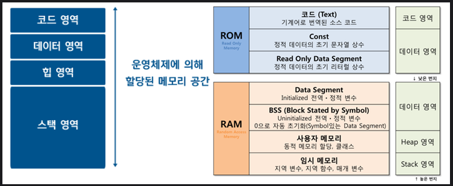
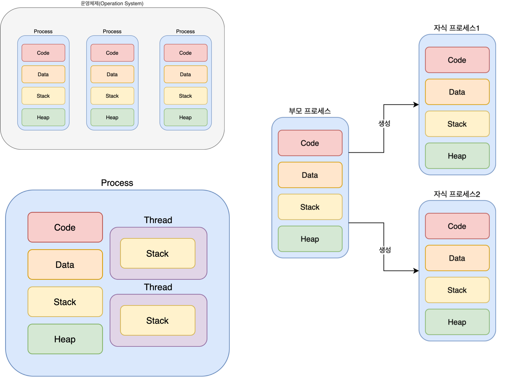
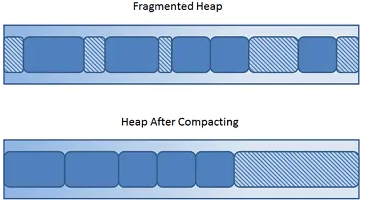

# Memory

###  Memory Area



- 프로세스내의 메모리 영역은 크게 4가지로 분류된다.
- Code, Data, Stack, Heap

- 

------

#### Code

- 실행할 프로그램의 코드가 저장되는 영역으로 텍스트(code)영역이라고도 부른다.
- 컴파일 후 기계어 형태로 저장되어 있다.
- 코드영역은 실행 파일을 구성하는 명령어들이 올라가는 메모리 영역으로 함수, 제어문, 상수 등이 여기에 지정된다.

- 프로그램 시작과 동시에 할당되며 프로그램 종료까지 유지된다.

------

#### Data

- Global 변수, Static 변수가 할당되는 영역
- 프로그램 시작과 동시에 할당되며 프로그램 종료까지 유지된다.
- Data 영역은 BSS(Block Started Symbol) 영역과 Data영역으로 분할된다.
  - BSS : 초기화되지 않은 변수들이 할당되고, main 함수가 실행되기전 관련된 변수들을 Default 값으로 초기화한다.
  - Data : 초기화가 이루어진 변수들이 할당된다.

------

#### Stack

- Local 변수,  매개변수, return address, enum 등이 할당되는 영역
- 함수 호출시 자동 할당되고 종료되면 해제된다.
- Stack 자료구조와 동일한 방식으로 FILO
- 컴파일 타임에 크기가 결정된다.
- 메모리 높은 주소 부터 낮은 주소로 할당

------

#### Heap

- 동적으로 생성된 참조타입의 변수가 할당된다.
- 프로그래머가 동적으로 직접 할당하고 해제하는 영역
- 런타임에 크기가 결정된다.
- 메모리 낮은 주소부터 높은 주소로 할당

------

#### Stack영역과 Heap 영역


- 같은 여유 공간을 상/하(낮은 주소/ 높은 주소)로 나누어 필요에 따라 확장해가며 사용
- 힙을 많이 사용할 경우 스택의 이용공간이 줄어들고, 반대의 경우 힙의 이용공간이 줄어든다.
- 힙은 낮은 주소부터 높은주소로 할당되며 스택은 높은 주소부터 낮은 주소 할당된다.
- 서로가 서로의 영역을 넘을 경우 각각 Stack & Heap OverFlow가 발생한다.

------

#### Object Size

- C++을 기준으로 Object의 크기는 다음 요소로 결정된다.

  - 모든 비정적 멤버의 크기

    ```c++
    class Parent {
    public:
    	int iMem1;			//4byte
    	static int iMem2;	//4byte
    };
    
    //Parent의 크기는 정적 멤버인 iMem2를 제외한 4byte가 된다.
    ```

    

  - BytePadding

    - 캐시라인에 맞춰 메모리 액세스를 최적화하기 위해 바이트를 추가하여 사이즈를 맞춘다.

    ```c++
    class Parent {
    public:
    	char iMem1;			//1byte
    	int iMem2;			//4byte
    };
    
    //iMem1(1byte + padding byte(3)) + iMem2(4)
    //Parent의 크기는 Padding byte가 추가된 8byte가 된다.
    ```

    

  - 멤버의 순서

    ```c++
    class ParentA {
    public:
    	char iMem1;			//1byte
    	int iMem2;			//4byte
    	char iMem3;			//1byte
    };
    
    class ParentB {
    public:
    	char iMem1;			//1byte
    	char iMem3;			//1byte
    	int iMem2;			//4byte
    };
    
    //[ParentA의 크기]				  = 12byte
    //[iMem1, pad, pad, pad]		= 4byte(1byte + 3byte(pad))
    //[iMem2, iMem2, iMem2, iMem2]	= 4byte
    //[iMem3, pad, pad, pad]		= 4byte(1byte + 3byte(pad))
    
    //[ParentB의 크기]				  = 8byte
    //[iMem1, iMem3, pad, pad]		= 4byte(1byte + 1byte + 2byte(pad))
    //[iMem2, iMem2, iMem2, iMem2]	= 4byte
    ```

    

  - 상속

    - 부모 클래스의 크기도 포함한다.

    ```c++
    class Parent {
    public:
    	char iMem1;
    };
    
    class Child : Parent{
    public:
    	char iMem1;
    };
    
    //Child의 크기는 2byte(Parent.iMem1 + Child.iMem1)가 된다.
    ```

    

  - Virtual 기능

    - 가상함수를 사용하면 4byte의 가상 테이블 포인터 크기가 추가로 요구된다.

    ```c++
    class Parent {
    public:
    	char iMem1;
    };
    
    class Child : Parent{
    public:
    	char iMem1;
    	virtual void Test() {
    
    	}
    };
    
    //Child의 크기는 8byte가 된다.
    //[Parent.iMem1, Child.iMem1, pad, pad] = 4byte(1byte + 1byte + 2byte(pad))
    //[vPtr]								= 4byte
    ```

    

  - 컴파일러

    - 사용중인 컴파일러에 따라 다르다.

    ```c++
    class BaseClass { 
            int a; 
            char c; 
    }; 
     
    class DerivedClass : public BaseClass { 
            char d; 
            int i; 
    }; 
    
    //Microsoft C++에서 DerivedClass의 크기는 16byte. 
    //gcc(c++ 또는 g++)에서 DerivedClass의 크기는 12byte.
    
    //MC++은 각 클래스를 4바이트 정렬 주소로 시작하여 해당 클래스의 멤버에 쉽게 액세스할 수 있도록 하기 때문.
    ```


------

#### Memory Sharing



- 멀티 스레드를 사용하는 경우 code, data, heap 영역은 공유해서 사용되지만 stack은 따로 사용.
- 프로세스는 각각 독립적인 메모리 공간을 가지므로 프로세스간 자원 공유를 위해서는 IPC(Inter-Process Commnuication)를 활용한다.
- 프로세스내 또 다른 프로세스가 있는 경우 메모리가 페이징으로 관리된다면 동일한 코드 영역의 페이지를 이용 할수 있다.
  - 공유되는 코드 영역은 read only
  - 프로세스는 동일한 코드를 이용해야 한다.

------

#### Fragmentation

- Internal Fragmentation

  - 성능향상과 같은 이유로 메모리 공간이 낭비되는 경우
  - 캐시 hit 와 메모리 액세스를 최소화 하기위해 삽입되는 패딩.
  - External Fragmentation을 해결하기 위해 사용된 페이징 기법을 사용했을 때 분할된 공간보다 작은 량의 공간을 쓰는 경우

- External Fragmentation

  - 충분한 크기의 메모리 공간이 있지만 작게 파편화되어 있어 필요한 크기의 연속적인 메모리 블록을 찾을 수 없어 메모리를 할당할 수 없는 상황

    

  - heap 영역의 쓰기 및 해제가 많아지게 되면 heap 영역이 작게 조각화 되는 heap fragmentation이 발생

  - internal fragmentation을 해결하기 위해 세그먼테이션 기법을 이용하는 경우

- Fragmentation 해결하는 방법들

  - 페이징 : 외부단편화를 해결하지만 내부단편화는 존재
  - 세그먼테이션 : 내부단편화를 해결하지만 외부단편화는 존재
  - 가비지 콜렉션 : 프로세스내 힙 메모리 사용시 발생한 외부 단편화를 해결하는 압축기법
  - Paged segmentation : 페이지와 세그먼트를 부분적으로 사용
    - MMU를 두번 거치므로 속도 저하 문제를 가짐
  - 현재의 운영체제는 페이징 기법을 사용


------

### Ref

- [https://charlezz.medium.com/process%EC%99%80-thread-%EC%9D%B4%EC%95%BC%EA%B8%B0-5b96d0d43e37](https://charlezz.medium.com/process%EC%99%80-thread-%EC%9D%B4%EC%95%BC%EA%B8%B0-5b96d0d43e37)
- [https://www.cprogramming.com/tutorial/size_of_class_object.html](https://www.cprogramming.com/tutorial/size_of_class_object.html)
- [https://stackoverflow.com/questions/24358105/do-modern-oss-use-paging-and-segmentation](https://stackoverflow.com/questions/24358105/do-modern-oss-use-paging-and-segmentation)

