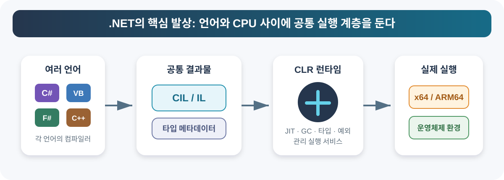

> 핵심 요약
> - C#은 언어, .NET은 개발·실행 플랫폼, Mono와 CoreCLR은 .NET 코드를 실행하는 런타임이다.
> - Unity는 에디터와 Mono 플레이어의 런타임을 CoreCLR로 교체하지만, AOT 빌드 경로인 IL2CPP는 계속 유지한다.
> - 2026년 7월 기준 CoreCLR 데스크톱 플레이어는 Unity 6.7 Alpha에서 실험 단계이며, 전체 에디터 전환 목표는 Unity 6.8이다.

Unity의 C# 실행 환경이 큰 변화를 앞두고 있다. Unity는 오랫동안 사용한 Mono를 걷어내고, 현대 .NET의 런타임인 CoreCLR로 에디터와 데스크톱 플레이어를 전환하고 있다.

이 변화를 이해하려면 C#, .NET, 런타임, IL2CPP를 서로 다른 층으로 나눠 봐야 한다. 이 글은 .NET의 출발점부터 Unity의 현재 실행 구조, Mono와 CoreCLR의 차이, 버전별 도입 현황과 프로젝트 준비 사항까지 순서대로 설명한다.

> 이 글의 버전별 현황은 **2026년 7월 23일**을 기준으로 한다. Alpha 및 로드맵 일정은 변경될 수 있으므로 실제 도입 전에는 최신 Unity 릴리스 노트와 업그레이드 가이드를 다시 확인해야 한다.

## 한눈에 보는 전체 구조

| 구분 | 정체 | Unity에서의 역할 |
| --- | --- | --- |
| C# | 프로그래밍 언어 | 게임 로직과 에디터 확장 코드를 작성한다. |
| .NET | 개발·실행 플랫폼 | 런타임, 기본 클래스 라이브러리와 개발 도구의 기반을 제공한다. |
| Mono | .NET 런타임 구현체 | 기존 Unity 에디터와 Mono 플레이어에서 IL을 JIT 실행한다. |
| CoreCLR | 현대 .NET의 주요 런타임 | 차세대 Unity 에디터와 데스크톱 플레이어에서 Mono를 대체한다. |
| IL2CPP | Unity의 AOT 빌드 백엔드 | IL을 C++로 변환한 뒤 대상 플랫폼의 네이티브 코드로 미리 컴파일한다. |

한 줄로 줄이면 **C#은 언어, Mono와 CoreCLR은 실행 엔진, IL2CPP는 네이티브 빌드 경로**다.

## .NET은 왜 만들어졌을까

1990년대의 Windows 개발 환경에서는 언어마다 컴파일 방식, 타입 체계와 메모리 관리 방식이 달랐다. Visual Basic과 Visual C++처럼 서로 다른 언어로 만든 구성 요소를 연결하려면 COM과 같은 별도의 기술이 필요했다.

Microsoft가 .NET에서 제시한 해법은 **언어와 CPU 사이에 공통 실행 계층을 두는 것**이었다. 각 언어의 컴파일러가 공통 형식인 IL과 메타데이터를 만들고, CLR이 이를 현재 CPU에 맞는 기계어로 변환한다.



```text
C#, Visual Basic, F# 등
  ↓ 각 언어 컴파일러
CIL(IL) + 타입 메타데이터
  ↓ CLR
JIT 컴파일 + 관리 실행 서비스
  ↓
현재 CPU의 네이티브 기계어
```

IL은 특정 CPU 명령어에 직접 종속되지 않는다. CLR이 해당 CPU를 지원한다면 같은 IL 어셈블리를 x64나 ARM64용 기계어로 변환할 수 있다. 공통 타입 시스템과 메타데이터 덕분에 서로 다른 .NET 언어가 같은 라이브러리를 사용하고 타입을 주고받는 것도 가능하다.

이 구조에는 두 가지 독립성이 담겨 있다.

- **언어 독립성**: C#, Visual Basic, F# 등이 같은 런타임과 타입 체계를 사용한다.
- **CPU 독립성**: IL을 실행 환경의 x64, ARM64 등 네이티브 코드로 변환한다.

다만 2002년에 공개된 초기 `.NET Framework` 제품은 Windows 중심이었다. 이후 Mono가 이 실행 모델을 다른 운영체제에 구현했고, .NET Core와 현대 `.NET`을 거치면서 Microsoft의 공식 크로스 플랫폼 전략이 본격화됐다.

### .NET 발전 흐름

| 시기 | 변화 | 의미 |
| --- | --- | --- |
| 2000년대 초 | C#, CLR, .NET Framework 등장 | 여러 언어를 IL과 공통 런타임으로 통합했지만 제품은 Windows 중심이었다. |
| 2000년대 | CLI와 C#의 ECMA 표준화, Mono 성장 | 표준화된 실행 모델을 Windows 밖에서도 구현할 수 있게 됐다. |
| 2016년 | .NET Core 1.0 | Microsoft가 오픈소스·크로스 플랫폼 .NET을 공식 제공하기 시작했다. |
| 2020년 이후 | .NET 5+ 통합 브랜드 | .NET Core의 흐름을 이어 현대 .NET으로 통합했다. |
| Unity의 현재 전환 | Mono에서 CoreCLR로 | Unity의 C# 실행 기반을 현대 .NET 계열에 맞춘다. |

### .NET Framework와 현대 .NET

`.NET Framework`는 Windows 중심으로 발전한 기존 .NET 플랫폼이고, 그 런타임은 CLR이다. 현대의 크로스 플랫폼 `.NET`은 .NET Core를 계승하며 CoreCLR을 주요 런타임으로 사용한다.

Unity의 `API Compatibility Level`에서 `.NET Framework`를 선택하는 것은 Microsoft CLR로 Unity를 실행한다는 뜻이 아니다. 이 설정은 C# 코드에서 사용할 수 있는 .NET API 범위를 선택한다. 실제 실행 방식은 별도의 `Scripting Backend`가 결정한다.

## Mono는 왜 등장했을까

초기 .NET Framework의 실행 모델은 표준화된 IL과 CLI를 사용했지만, 실제 제품과 클래스 라이브러리는 Windows에 강하게 묶여 있었다. .NET으로 작성한 프로그램을 Linux나 macOS에서 실행하려면 해당 운영체제에서 IL을 실행할 런타임과 호환 클래스 라이브러리가 필요했다.

이 역할을 목표로 시작된 오픈소스 프로젝트가 **Mono**다.

Mono 프로젝트는 2001년에 발표됐고, 2004년에 1.0 버전이 공개됐다. Microsoft의 .NET Framework 실행 모델을 그대로 복제하는 데 그치지 않고, ECMA가 표준화한 C#과 CLI를 기반으로 다음 구성 요소를 제공했다.

- IL을 실행하는 JIT·AOT 런타임
- C# 컴파일러
- .NET Framework 호환 클래스 라이브러리
- 가비지 컬렉터와 스레드 시스템
- 관리 코드와 네이티브 코드를 연결하는 상호 운용 기능

Mono의 핵심 가치는 **하나의 .NET 실행 모델을 여러 운영체제와 CPU 아키텍처에 구현했다는 것**이다.

```text
같은 C# 소스와 IL 어셈블리
  ├─ Windows x86/x64
  ├─ Linux x86/x64
  ├─ macOS
  ├─ ARM 계열
  └─ 여러 콘솔·모바일 환경
```

플랫폼마다 Mono 런타임과 네이티브 연동 계층을 준비하면 C# 코드의 상당 부분을 공유할 수 있었다. 단, Windows 전용 API나 특정 운영체제 기능을 직접 사용한 코드는 여전히 별도의 대응이 필요했다.

### Mono 프로젝트의 변화

Mono는 Ximian에서 시작해 Novell과 Xamarin의 지원을 거쳤으며, Xamarin이 Microsoft에 인수된 이후 Microsoft와 .NET Foundation 생태계에 합류했다. Mono가 모바일, 게임 엔진, 임베디드 런타임에 축적한 경험은 이후 현대 .NET의 크로스 플랫폼 발전에도 활용됐다.

| Mono가 제공한 특성 | 크로스 플랫폼 개발에서의 의미 |
| --- | --- |
| ECMA C#·CLI 구현 | Microsoft CLR과 같은 IL 실행 모델을 다른 환경에 구현할 수 있었다. |
| 다양한 CPU용 JIT·AOT | x86, x64, ARM 등 서로 다른 아키텍처를 지원할 수 있었다. |
| .NET 호환 클래스 라이브러리 | C# 코드와 기존 .NET 지식을 여러 플랫폼에서 재사용할 수 있었다. |
| 네이티브 애플리케이션 임베딩 | C/C++ 프로그램 안에 Mono 런타임을 넣어 C#을 스크립트 계층으로 사용할 수 있었다. |
| 오픈소스와 이식 가능한 구조 | 엔진이나 플랫폼 요구에 맞게 런타임을 수정하고 배포하기 쉬웠다. |

## Unity는 왜 Mono를 선택했을까

초기 Unity 엔진의 중심은 C++였지만, 게임 로직까지 모두 C++로 작성하게 하면 개발 난도가 높고 반복 작업도 느려진다. Unity에는 생산성이 높은 스크립트 언어와 이를 C++ 엔진 안에서 실행할 수 있는 런타임이 필요했다.

Unity 공식 회고에 따르면 초기 Unity는 다음 이유로 Mono와 C#을 활용했다.

- C#은 C++보다 단순하고 생산성이 높은 관리 언어였다.
- JIT 컴파일을 통해 C# 코드를 비교적 효율적인 네이티브 코드로 실행할 수 있었다.
- Mono 런타임을 C++ 애플리케이션에 임베딩할 수 있었다.
- Mono가 여러 운영체제와 CPU를 지원해 Unity의 멀티플랫폼 방향과 잘 맞았다.
- GC, 리플렉션, 타입 정보와 풍부한 클래스 라이브러리를 스크립팅 계층에서 사용할 수 있었다.

역할은 자연스럽게 두 계층으로 나뉘었다.

```text
Unity 네이티브 엔진
  └─ C++
     렌더링, 물리, 플랫폼 연동과 성능 핵심 영역

Unity 스크립팅 계층
  └─ C# + Mono
     게임 로직, 컴포넌트, 에디터 확장과 사용자 코드
```

C++은 성능과 메모리 배치를 세밀하게 제어하는 엔진 코어에 적합했고, C#은 게임 제작자가 빠르게 작성하고 수정하는 게임 로직에 적합했다. Mono는 두 계층 사이에서 C# 어셈블리를 로드하고 JIT 컴파일하며, C#과 C++ 사이의 호출을 연결했다.

### 당시 Microsoft CLR 대신 Mono가 적합했던 이유

초기 Microsoft .NET Framework CLR은 Windows 중심이었고, Unity는 macOS를 포함한 여러 환경에서 동일한 C# 스크립팅 경험을 제공해야 했다. 반면 Mono는 크로스 플랫폼 실행과 네이티브 애플리케이션 임베딩을 프로젝트의 주요 사용 사례로 지원했다.

Unity는 Mono를 그대로 사용하는 데서 끝나지 않고 엔진 요구에 맞춘 자체 포크를 오랫동안 유지했다. 이후 iOS와 일부 콘솔처럼 JIT를 사용할 수 없는 플랫폼이 늘어나자 IL2CPP라는 별도의 AOT 빌드 경로도 개발했다.

```text
에디터와 JIT 허용 플레이어
  C# → IL → Mono → JIT 실행

JIT 제한 또는 AOT 대상 플랫폼
  C# → IL → IL2CPP → C++ → 네이티브 실행
```

Mono는 Unity가 C# 기반의 생산성과 멀티플랫폼 배포를 함께 확보할 수 있게 한 기반이었다. 동시에 Unity 전용 포크가 장기간 유지되면서 최신 .NET과의 격차, 오래된 GC, 도메인 리로드와 도구 체계 같은 기술 부채도 누적됐다.

현재의 CoreCLR 전환은 Mono의 역할을 부정하는 작업이 아니다. Mono가 먼저 열었던 크로스 플랫폼 .NET의 역할을 현대 .NET의 주류 런타임으로 계승하는 과정이다.

## .NET Core와 CoreCLR의 등장

초기 Unity가 Mono를 선택한 뒤 Microsoft의 .NET 전략도 크게 달라졌다. 가장 중요한 변화는 Windows 중심의 .NET Framework와 별도로 **오픈소스·크로스 플랫폼 .NET**을 만들기 시작한 것이다.

Microsoft는 2014년부터 .NET Core를 오픈소스로 공개하고 Windows, Linux, macOS를 함께 지원하는 단일 크로스 플랫폼 .NET 스택을 개발했다. .NET Core의 런타임인 CoreCLR도 특정 Windows 제품에 묶인 런타임이 아니라, 여러 운영체제와 CPU 아키텍처를 지원하는 오픈소스 런타임으로 발전했다.

2020년 `.NET 5`부터 .NET Core는 현대 `.NET`이라는 통합 이름을 사용한다. 이후 .NET은 매년 새 주요 버전을 공개하고, Microsoft와 커뮤니티가 하나의 주류 코드베이스를 중심으로 런타임, 기본 클래스 라이브러리와 개발 도구를 함께 발전시키고 있다.

```text
과거
  .NET Framework CLR ── Windows 중심
  Mono               ── 크로스 플랫폼 대안

현재
  현대 .NET + CoreCLR ── 공식 오픈소스·크로스 플랫폼 주류
  Mono                ── 모바일·임베디드·레거시 역할을 수행한 별도 계보
```

이제 Unity가 멀티플랫폼을 위해 반드시 Mono를 유지해야 할 이유는 줄어들었다. CoreCLR도 Windows, Linux, macOS와 여러 CPU를 지원하면서 최신 .NET API, C# 언어, GC, JIT와 도구 체계에 직접 연결되기 때문이다.

### Mono 생태계의 중심도 현대 .NET으로 이동

Mono가 완전히 사라진 것은 아니다. Mono 계열 기술은 현대 .NET 안에서 모바일, WebAssembly와 AOT 시나리오 등에 활용되고 있으며, WineHQ도 Wine에서 사용하는 Mono 프로젝트를 이어가고 있다.

그러나 **기존 `mono/mono` 프로젝트가 .NET 생태계의 주류 런타임으로 계속 발전하는 단계는 끝났다.**

- 기존 Mono 프로젝트의 마지막 주요 릴리스는 2019년 7월이었다.
- 마지막 패치 릴리스는 2024년 2월이었다.
- Microsoft는 2024년에 기존 Mono 프로젝트의 관리 역할을 WineHQ로 이전했다.
- Microsoft는 최신 Mono 포크의 작업을 `dotnet/runtime`에 통합했고, 활성 Mono 사용자는 현대 .NET으로 이전할 것을 권장했다.

Unity는 기존 `mono/mono` 바이너리를 그대로 사용하는 것이 아니라 자체 포크를 유지해 왔다. 따라서 기존 Mono 프로젝트의 관리 이전이 Unity 런타임을 즉시 중단시키는 것은 아니다.

다만 생태계의 투자와 기술 발전은 현대 .NET 저장소로 모이고 있다. Unity도 자체 Mono 포크를 계속 발전시키는 것보다 CoreCLR에 합류하는 편이 최신 기술을 받아들이고 장기 유지보수 부담을 줄이기 유리해졌다.

### Mono 선택에서 CoreCLR 전환까지

| 초기 Unity가 Mono를 선택한 조건 | 현재 Unity가 CoreCLR로 이동하는 조건 |
| --- | --- |
| Microsoft CLR은 Windows 중심 | CoreCLR이 공식 크로스 플랫폼 런타임으로 성장 |
| Mono가 Linux·macOS와 여러 CPU 지원 | 현대 .NET이 Windows·Linux·macOS와 다양한 CPU를 공식 지원 |
| Mono를 C++ 엔진에 임베딩 가능 | CoreCLR 호스팅과 Unity 전용 통합 기반 마련 |
| C#과 JIT로 생산성 높은 스크립팅 제공 | 최신 C#, JIT, GC와 코드 리로드 기능 활용 가능 |
| 오픈소스 런타임을 Unity 요구에 맞게 수정 | Microsoft·커뮤니티가 발전시키는 주류 코드베이스에 합류 |
| .NET Framework 호환 API를 여러 플랫폼에 제공 | 최신 .NET API와 MSBuild·`csproj` 도구 생태계에 직접 연결 |

핵심은 Mono의 크로스 플랫폼 장점이 사라진 것이 아니다. **과거에는 Mono가 제공하던 장점을 이제 현대 .NET과 CoreCLR도 더 큰 생태계와 빠른 업데이트 주기 위에서 제공한다.**

Unity의 CoreCLR 전환은 완전히 새로운 실행 방식을 도입하는 작업이 아니다. Unity가 이미 사용해 온 **IL과 관리 런타임 구조를 현대 .NET의 주류 구현으로 옮기는 과정**이다.

## C# 코드가 Unity에서 실행되는 과정

### Unity 에디터에서 Play할 때

Unity는 C# 소스 코드를 바로 실행하지 않는다. Roslyn C# 컴파일러가 프로젝트 코드를 먼저 IL과 메타데이터가 담긴 관리 어셈블리로 만든다.

```text
C# 소스 코드
  ↓ Roslyn C# 컴파일러
IL + 메타데이터가 포함된 관리 어셈블리
  ↓ Unity 에디터의 관리 런타임
JIT 컴파일
  ↓
CPU가 실행할 네이티브 기계어
```

현재의 Mono 기반 Unity 에디터에서는 Mono가 이 어셈블리를 로드하고 실행한다. 런타임은 IL을 기계어로 바꾸는 것 외에도 관리 객체의 메모리, 가비지 컬렉션, 예외, 리플렉션, 스레드와 어셈블리 로딩을 담당한다.

Unity가 CoreCLR 에디터로 전환한다는 것은 이 실행 계층을 Mono에서 CoreCLR로 바꾼다는 의미다. C#이라는 언어 자체를 다른 언어로 교체하는 것이 아니다.

### Mono 플레이어로 빌드할 때

Mono 스크립팅 백엔드는 관리 어셈블리와 Mono 런타임을 플레이어에 포함한다. 게임이 실행되면 Mono가 IL을 JIT 컴파일한다.

```text
C# → IL 어셈블리 → Mono 런타임 → JIT → 기계어 실행
```

게임 사용자가 Mono나 .NET을 따로 설치할 필요는 없다. Unity가 플레이어에 필요한 런타임을 함께 배포한다.

### IL2CPP 플레이어로 빌드할 때

IL2CPP는 빌드 시점에 코드를 대상 플랫폼용 기계어로 미리 변환한다.

```text
C# 소스 코드
  ↓ Roslyn
IL 어셈블리
  ↓ 코드 스트리핑
C++ 코드
  ↓ 플랫폼 네이티브 C++ 컴파일러
기계어가 포함된 실행 파일 또는 라이브러리
```

이 방식에서는 게임 실행 중 Mono나 CoreCLR이 IL을 JIT 컴파일하지 않는다. 대신 GC, 타입 메타데이터, 예외, 리플렉션처럼 C#의 관리 실행 모델에 필요한 기능은 IL2CPP 런타임이 제공한다.

IL2CPP 플레이어는 Mono/CoreCLR JIT 런타임을 사용하지 않는다. 그러나 관리 객체, GC, 타입과 예외를 지원하는 **IL2CPP 전용 런타임**은 포함한다.

### CoreCLR은 IL2CPP를 대체하지 않는다

Mono와 CoreCLR은 같은 JIT 런타임 자리를 두고 교체되는 관계다. IL2CPP는 이들과 별도로 유지되는 AOT 빌드 경로다.

```text
Unity 에디터와 데스크톱 JIT 플레이어
  Mono → CoreCLR

AOT 플레이어
  IL2CPP 유지
```

CoreCLR 전환 뒤에도 iOS처럼 JIT가 허용되지 않거나 AOT 배포가 필요한 환경에서는 IL2CPP가 계속 사용된다.

## Mono와 CoreCLR 비교

| 항목 | Unity Mono | CoreCLR |
| --- | --- | --- |
| 계보 | Mono 프로젝트를 기반으로 한 Unity용 구현 | 현대 .NET의 주요 오픈소스 런타임 |
| 코드 실행 | IL을 JIT 컴파일 | IL을 JIT 컴파일 |
| Unity의 현재 역할 | 기존 에디터와 Mono 플레이어의 관리 런타임 | 차세대 에디터와 데스크톱 플레이어 런타임 |
| GC | Boehm 기반의 보수적·비이동 GC | 정확한 추적과 객체 이동을 지원하는 세대별 GC |
| 어셈블리 관리 | 기존 AppDomain과 도메인 리로드 중심 | Assembly Load Context를 활용할 수 있는 현대적 구조 |
| .NET 생태계 | Unity가 지원하는 비교적 오래된 API·도구 체계 | 최신 .NET API, 언어와 도구 체계로 발전하기 쉬움 |
| Unity에서의 상태 | 단계적으로 제거 예정 | 단계적으로 도입 중 |

둘 다 IL을 JIT 방식으로 실행한다. 가장 큰 차이는 CoreCLR이 Microsoft가 지속적으로 발전시키는 현대 .NET의 주류 런타임이라는 점이다.

### 가비지 컬렉터의 차이

Unity가 사용해 온 Boehm GC는 보수적이며 객체를 메모리에서 이동시키지 않는다. 관리 코드와 네이티브 C++ 엔진이 오랫동안 이 특성을 전제로 연결되어 왔다는 장점이 있지만, 어떤 값이 실제 객체 참조인지 정확히 알 수 없는 경우가 있고 메모리 압축도 제한된다.

CoreCLR GC는 관리 객체 참조를 더 정확히 추적하고 객체를 이동시킬 수 있다. 세대별 수집과 메모리 압축을 포함한 현대적인 GC 설계를 활용할 수 있지만, 네이티브 코드가 관리 객체의 주소를 오래 보관하면 객체 이동 후 잘못된 포인터가 될 수 있다.

이 차이 때문에 전환 작업은 런타임 DLL 하나를 교체하는 수준에 그치지 않는다. C#과 C++ 사이의 바인딩, 직렬화, 관리 객체 핸들, 에디터 코드와 패키지까지 CoreCLR의 메모리 모델에 맞춰야 한다.

## Unity가 CoreCLR로 전환하는 이유

### 최신 .NET과 C# 생태계

기존 Unity 환경은 일반적인 .NET 개발 환경보다 지원하는 C# 언어 버전과 기본 클래스 라이브러리의 업데이트가 늦었다. CoreCLR을 기반으로 전환하면 최신 .NET API, C# 언어 기능과 외부 라이브러리를 더 빠르게 받아들일 수 있는 기반이 생긴다.

Unity 6.8의 현재 목표는 .NET 10 기반 도구 체계와 기본 클래스 라이브러리, C# 14 지원이다.

### 에디터 반복 작업 시간 개선

현재 Unity는 스크립트가 변경되면 도메인 리로드를 수행하며 정적 상태와 관리 환경을 다시 초기화한다. 프로젝트가 커질수록 스크립트 컴파일 후 대기 시간과 Play Mode 진입 시간이 길어진다.

Unity는 CoreCLR의 `AssemblyLoadContext`를 이용해 전체 도메인을 다시 시작하는 방식에서 더 세분된 코드 리로드 방식으로 이동하려 한다. 목표는 다음과 같은 반복 작업 시간을 줄이는 것이다.

```text
코드 수정 → 컴파일 → 코드 리로드 → Play Mode 확인
```

Unity 6.8의 우선 목표는 기존 환경과의 기능 및 성능 동등성이다. 큰 폭의 성능 향상보다 기존 프로젝트와 패키지를 안정적으로 전환하는 데 초점을 맞춘다.

### 더 현대적인 GC

CoreCLR GC는 세대별 수집, 정확한 참조 추적과 이동식 객체 관리 등 현대 .NET의 메모리 관리 기능을 제공한다. Unity는 이를 통해 장기적으로 GC 오버헤드와 메모리 사용 특성을 개선할 기반을 확보하려 한다.

하지만 GC 특성이 바뀌므로 네이티브 플러그인, 포인터를 사용하는 코드, 마샬링과 직렬화 시스템에는 호환성 검증이 필요하다.

### MSBuild와 표준 .NET 도구

Unity는 CoreCLR 전환과 함께 MSBuild 및 사용자 정의 가능한 `csproj` 기반 빌드, IDE와의 양방향 연동을 추진하고 있다. Unity 전용으로 분리되어 있던 C# 빌드 환경을 일반 .NET 도구 생태계와 더 가깝게 만드는 것이 목표다.

### 장기 유지보수

Mono 기반의 오래된 런타임과 Unity 전용 수정 사항을 계속 유지하는 대신, 활발하게 개발되는 현대 .NET 기반으로 이동하면 앞으로의 .NET 업데이트를 받아들이기 쉬워진다. CoreCLR은 단일 성능 기능이라기보다 Unity의 C# 계층을 장기적으로 현대화하기 위한 기반이다.

## CoreCLR 전환 현황

### Unity 6.6

Unity 6.6은 CoreCLR 전환에 필요한 작업 방식과 엔진 기반을 정리하는 단계다.

- 새 프로젝트에서 Fast Enter Play Mode를 기본값으로 전환
- Unity 내부 패키지와 엔진 코드를 CoreCLR 호환 방식으로 수정
- MSBuild 기반 스크립트 컴파일 파이프라인 준비
- 도메인 리로드 의존 코드를 찾기 위한 Project Auditor 지원 강화

Unity 6.8에서는 기존 방식의 도메인 리로드를 제거하고 Fast Enter Play Mode 방식만 사용하는 것이 현재 계획이다. 따라서 정적 필드 초기화나 Play Mode 종료 시 정리를 도메인 리로드에 의존하는 코드는 미리 점검해야 한다.

### Unity 6.7 Alpha

Unity `6000.7.0a2`부터 에디터가 Windows, macOS, Linux용 **실험적 CoreCLR 데스크톱 플레이어**를 빌드할 수 있다.

- Unity 에디터 자체는 아직 Mono 기반이다.
- 데스크톱 플레이어만 CoreCLR 백엔드를 시험할 수 있다.
- .NET Standard 2.1 API와 C# 9 범위는 기존 Mono 플레이어와 같다.
- 기능 검증이 목적이며 뚜렷한 성능 향상을 기대하는 단계는 아니다.
- 실험 기능이므로 실제 출시 프로젝트에 사용하는 것은 권장되지 않는다.

Unity는 6.7 LTS를 **Mono를 기반으로 하는 마지막 Unity 릴리스**로 계획하고 있다. 6.7 Alpha 기간에는 새로운 CoreCLR 플레이어와 현대화된 IL2CPP 경로를 공개 실험해 호환성을 검증한다.

### Unity 6.8

Unity 6.8은 전체 전환의 핵심 목표 버전이다.

| 영역 | Unity 6.8 목표 |
| --- | --- |
| Unity 에디터 | Mono를 제거하고 CoreCLR 기반으로 전환 |
| 데스크톱 플레이어 | 정식 CoreCLR 플레이어 제공 |
| IL2CPP 플레이어 | 유지하며 .NET 10·C# 14 기반으로 업데이트 |
| .NET | .NET 10 도구 체계와 기본 클래스 라이브러리 |
| C# | C# 14 |
| 코드 리로드 | 기존 도메인 리로드 대신 새로운 리로드 모델 적용 |

Unity 6.8의 초기 목표는 대규모 성능 향상보다 기존 프로젝트, 패키지와 도구가 CoreCLR에서 정상적으로 동작하도록 만드는 것이다. Unity는 기능 및 전체적인 성능 동등성을 먼저 달성하고, 본격적인 최적화는 2027년의 후속 LTS 단계에서 진행할 계획이라고 밝혔다.

## 기존 프로젝트에서 준비할 부분

### 도메인 리로드 의존성 확인

정적 필드가 Play Mode 진입 때마다 자동으로 초기화될 것이라고 가정한 코드를 확인해야 한다.

```csharp
public static class GameSession
{
    public static int RetryCount;
}
```

도메인 리로드가 없으면 이전 Play Mode의 값이 남을 수 있다. `RuntimeInitializeOnLoadMethod` 등을 이용해 초기화 시점을 명시하거나, 상태의 생성과 해제를 코드에서 직접 관리하는 편이 안전하다.

### 네이티브 플러그인과 포인터 코드 확인

CoreCLR GC는 객체를 이동시킬 수 있으므로 관리 객체의 주소가 계속 고정되어 있다고 가정하면 안 된다. P/Invoke, 마샬링, `unsafe` 코드와 네이티브 플러그인은 특히 점검이 필요하다.

### 동적 어셈블리 로딩 확인

CoreCLR 에디터의 코드 리로드 모델 때문에 일부 `Assembly.Load` 계열 API는 제한되거나 Unity가 제공하는 대체 API가 필요할 수 있다. 에디터 확장이나 런타임 모딩 시스템이 동적으로 DLL을 불러온다면 Unity 6.8 업그레이드 가이드를 확인해야 한다.

### 외부 DLL의 대상 프레임워크 확인

Unity 6.7의 실험적 CoreCLR 플레이어는 아직 기존과 같은 .NET Standard 2.1 및 C# 9 범위를 사용한다. Unity 6.8에서는 .NET 10 기반으로 전환되므로 사전 컴파일된 DLL의 대상 프레임워크와 API 호환성을 별도로 확인해야 한다.

### 별도 브랜치와 복사본에서 실험 버전 검증

Unity 6.7 Alpha의 CoreCLR 플레이어는 프로덕션 지원 대상이 아니다. 프로젝트와 브랜치를 백업한 뒤 다음 항목을 중심으로 검증하는 것이 좋다.

- 빌드 성공 여부
- 시작과 종료 과정
- 직렬화 및 데이터 마이그레이션
- 리플렉션과 동적 코드
- 네이티브 플러그인
- GC 할당량과 프레임 지연
- 기존 Mono 플레이어와의 기능 차이

## 정리

C#은 Unity 스크립트를 작성하는 언어이고, .NET은 그 코드를 컴파일하고 실행하는 플랫폼이다. Mono와 CoreCLR은 IL을 JIT 방식으로 실행하는 .NET 런타임이며, IL2CPP는 IL을 네이티브 코드로 미리 변환하는 Unity의 AOT 백엔드다.

Unity의 CoreCLR 전환은 C#이나 IL2CPP를 제거하는 작업이 아니다. 기존 Mono 기반 에디터와 JIT 플레이어를 현대적인 CoreCLR 기반으로 교체하고, 동시에 IL2CPP도 새로운 .NET 및 C# 환경에 맞게 업데이트하는 작업이다.

2026년 7월 현재 CoreCLR 데스크톱 플레이어는 Unity 6.7 Alpha에서 실험적으로 사용할 수 있다. Unity 6.8에서는 Mono가 제거된 CoreCLR 에디터, 정식 데스크톱 플레이어, .NET 10과 C# 14 지원이 목표다. 다만 6.8의 첫 목표는 성능 혁신보다 호환성과 안정성이며, 본격적인 최적화는 그 이후 단계로 계획되어 있다.

## 참고

- [Microsoft Learn의 .NET 관리 실행 과정과 CIL 설명](https://learn.microsoft.com/ko-kr/dotnet/standard/managed-execution-process)
- [ECMA-335 Common Language Infrastructure 표준](https://ecma-international.org/publications-and-standards/standards/ecma-335/)
- [Mono 프로젝트 소개](https://www.mono-project.com/docs/about-mono/)
- [Mono 프로젝트 역사](https://www.mono-project.com/docs/about-mono/history/)
- [기존 Mono 프로젝트의 관리 이전 안내](https://github.com/mono/mono)
- [Microsoft의 .NET Core 오픈소스·크로스 플랫폼 전환 배경](https://devblogs.microsoft.com/dotnet/net-core-is-open-source/)
- [현대 .NET의 오픈소스와 크로스 플랫폼 지원](https://dotnet.microsoft.com/en-us/platform/free)
- [Unity 공식 회고: Unity and .NET, what's next?](https://unity.com/blog/engine-platform/unity-and-net-whats-next)
- [Unity 공식 CoreCLR 2026 업그레이드 가이드](https://discussions.unity.com/t/path-to-coreclr-2026-upgrade-guide/1714279)
- [Unity 공식 CoreCLR, Scripting, ECS 현황 업데이트 - 2026년 3월](https://discussions.unity.com/t/coreclr-scripting-and-ecs-status-update-march-2026/1711852)
- [Unity 공식 CoreCLR, Scripting, Serialization 업데이트 - 2026년 6월](https://discussions.unity.com/t/coreclr-scripting-and-serialization-update-june-2026/1723299)
- [Unity 6000.7.0a2 릴리스 노트](https://unity.com/releases/editor/alpha)
- [Unity의 CoreCLR 포팅과 GC 설명](https://unity.com/blog/engine-platform/porting-unity-to-coreclr)
- [Unity IL2CPP 개요](https://docs.unity3d.com/kr/current/Manual/scripting-backends-il2cpp.html)
- [Unity .NET 프로파일 지원](https://docs.unity3d.com/kr/6000.0/Manual/dotnet-profile-support.html)
